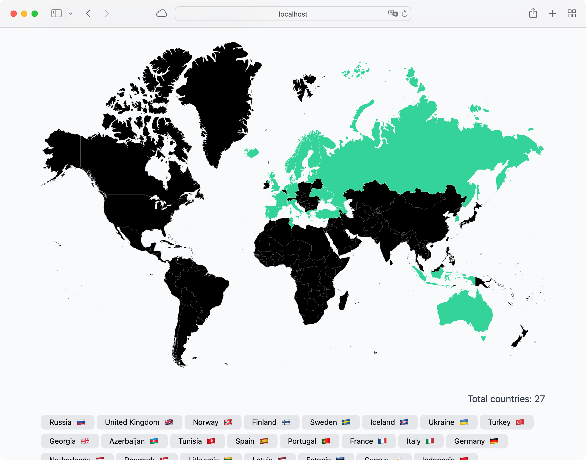

# Travel Map

Travel Map lets you mark countries you’ve visited on a world map and share the link with friends.



## Project setup
```sh
$ pnpm install
```

### Compiles and hot-reloads for development

```sh
$ pnpm run dev
```

### Compiles and minifies for production

```sh
$ pnpm run build
```

### Preview production build

```sh
$ pnpm run preview
```
